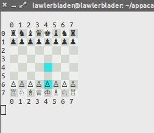

# chess
basic text-based functional duplicate

## Features

* Utilizes multiple levels of class inheritance to keep code DRY
* Allows players to move pieces by navigating  game board with a-w-s-d keys
* Supports networked and local play

###network play!

first terminal:
ruby network_game.rb

second terminal:
ruby network_game.rb 3000

###local play

- select movements via wasd and space or return

- save/load game state with ctrl+s and ctrl+l

ruby game.rb

###Go! Fight! Win!
